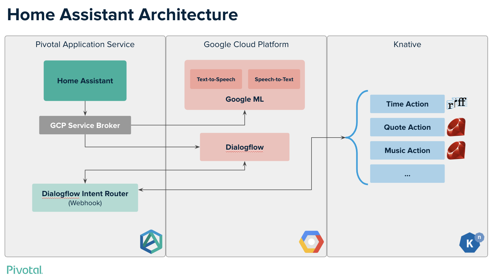
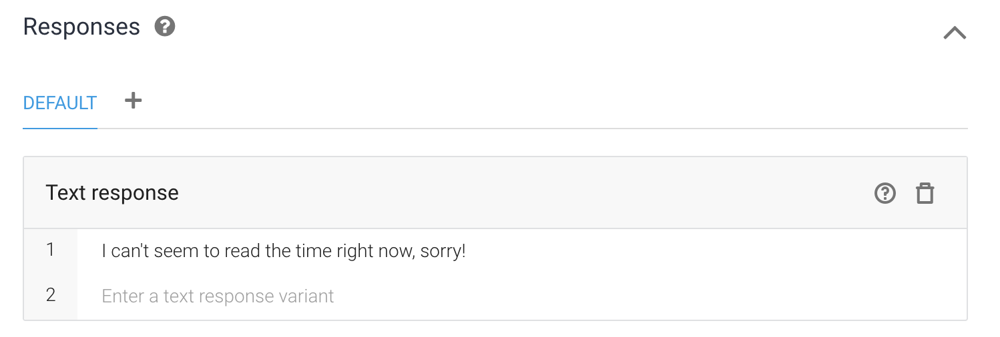
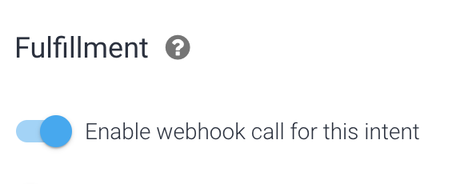
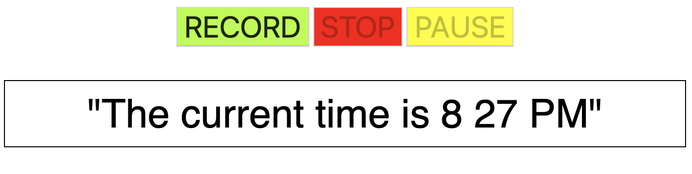

Knative Home Assistant
===

This demo shows how you can use different platforms to solve different pieces of the same application. Specifically, it builds a simple, rudimentary home assistant (Much like the Google Assistant/Home or Amazon Alexa). Specifically, it was built in a way that is easy to add functionality.

Overall, the point of the demo is to show what a complete platform can bring to improve development. Actions being built as Knative functions makes a lot of sense since traffic is sporadic. Cloud Foundry is, as always, a great solution for hosting traditional 12-factor applications such the frontend and the router.

Repositories
---

- **[Frontend](https://github.com/BrianMMcClain/knative-home-assistant)** - This repository, UI frontend
- **[Router](https://github.com/BrianMMcClain/knative-assistant-router)** - Handles Dialogflow responses and triggers appropriate action

**Actions**

- **[Time](https://github.com/BrianMMcClain/knative-assistant-action-time)** - Returns the current time
- **[Echo](https://github.com/bryanfriedman/knative-assistant-action-echo)** - Echos back what the user says
- **[Quotes](https://github.com/bryanfriedman/knative-quotes)** - Gives the users a random quote
- **[Language](https://github.com/BrianMMcClain/knative-assistant-action-language)** - Reimplementation of the Languages example from the [Dialogflow docs](https://dialogflow.com/docs/getting-started/extract-entities)
- **[Spotify](https://github.com/BrianMMcClain/knative-assistant-action-spotify)** - Play music on the logged in Spotify user's client via the [Spotify Web API](https://developer.spotify.com/documentation/web-api/)


Architecture
---



Our application is made up if two main components running on [Cloud Foundry](https://www.cloudfoundry.org/), plus a collection of functions running on [Knative](https://www.knative.dev/). Specifically the demo was built on [Pivotal Application Service (PAS)](https://pivotal.io/platform/pivotal-application-service) plus [Pivotal Function Service (PFS)](https://pivotal.io/platform/pivotal-function-service) running on [Pivotal Container Service (PKS)](https://pivotal.io/platform/pivotal-container-service). All of these make up the [PCF Platform](https://pivotal.io/platform). 

This demo has also been given with various components swapped for alternative services, for example at CF Summit 2019, we ran [Project riff](https://projectriff.io/) on top of [GKE](https://cloud.google.com/kubernetes-engine/).


Frontend
---

Our frontend has four responsibilities:

1. Record audio from the user
2. Transcribe audio to text using the [Google Speech-to-Text API](https://cloud.google.com/speech-to-text/)
3. Send that text to [Dialogflow](https://dialogflow.com/) to process intent and inputs
4. Once all processing is complete, the frontend displays and speaks a response to the user, using the [Google Text-to-Speech API](https://cloud.google.com/text-to-speech/)

Since our application is running on PAS, we can ease steps 2, 3, and 4 by installing the [GCP Service Broker](https://docs.pivotal.io/partners/gcp-sb/index.html). Refer to the [deploy.sh](deploy.sh) script to see how these services are created and bound to our application.

Router
---

The [router](https://github.com/BrianMMcClain/knative-assistant-router) acts as a webhook for Dialogflow, which sends the results of it's processing as a JSON payload. This payload defines things such as which intent name was matched, parameters that were extracted, provides our fallback text, etc. When triggered, our router processes uses the payload name to determine which action to invoke, passing along any provided parameters.

Actions
---

Actions are developed as Knative functions that are spun up on demand and spun down when not needed. These are only invoked by the router, which provides the parameters it received from Dialogflow along with the fallback text.

Developing Your Own Action
---

A new action requires two things: A Dialogflow Intent and a Knative function. Let's look at what goes into the Time action by starting with the Intent.

We can create a new intent named "Time" (this name is important, as it will match the function running on Knative) and give it a few training phrases:


We won't need to parameterized our input at all, but refer to the [Dialogflow documentation](https://dialogflow.com/docs/getting-started/extract-entities). Next, let's give it a fallback phrase incase it can't reach our action:



Finally, we'll configure our intent to use our preconfigured webhook (agian, our router running on PAS) under the "Fulfillment" section:



Next, we can deploy our [Time action](https://github.com/BrianMMcClain/knative-assistant-action-time). We'll give this the same name as our intent so that our router knows how to invoke it.

This was built specifically as a riff/PFS function and uses the Node.js invoker, meaning we can easily deploy this function using the riff CLI, providing the GitHub repo and a container registry to upload the resulting container. We'll also set the `TZ` environment variable to our desired timezone.

```
riff function create time --git-repo https://github.com/BrianMMcClain/knative-assistant-action-time --image $DOCKER_REPO/knative-assistant-action-time --verbose --env "TZ=America/New_York"
```

Once up and running, we can invoke this using our frontend!

